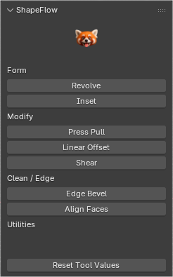

# ShapeFlow

**ShapeFlow** is a lightweight and professional Blender add-on focused on procedural shape creation and streamlined modeling workflows.

It is designed to improve speed, consistency, and control during common modeling tasks, especially in early and mid production stages.

ShapeFlow integrates naturally into Blender without altering scene units or forcing destructive operations.

---

## Core Focus

| Area | Description |
|-----|------------|
| Workflow speed | Fast access to common shape and modeling actions |
| Predictability | Clean transforms and consistent results |
| Integration | Designed to work with native Blender tools |
| Flexibility | Non-intrusive, artist-driven workflows |

---

## Features

- Fast insertion of common primitives
- Workflow-oriented shape tools
- Clean and predictable object transforms
- Non-destructive friendly operations
- Lightweight and responsive UI
- Designed for daily modeling tasks

---
<table align="center">
  <tr>
    <td align="center">
      
       <b>ShapeFlow</b>
     </tr>
</table>
---

## Workflow Philosophy

ShapeFlow is built around **flow-based modeling**, allowing artists to stay focused on form and structure.

Instead of heavy automation, ShapeFlow provides:
- Clear actions
- Minimal UI friction
- Results you can trust

The addon enhances Blender’s workflow without replacing it.

---

## UI Location

- View3D > Sidebar > ShapeFlow

(Additional panels and tools may be added over time.)

---

## Blender Version

- Blender 5.0+

---

## Roadmap

| Planned | Description |
|-------|------------|
| Shape presets | Extended procedural shape options |
| Pie menus | Faster access to common tools |
| Advanced tools | Optional workflow extensions |
| Optimization | Performance and usability improvements |

---

## License

This add-on is released under the **GNU General Public License v3.0 or later (GPL-3.0-or-later)**,  
in full compliance with Blender’s licensing requirements.

---

## Maintainer

**Panda Print**
